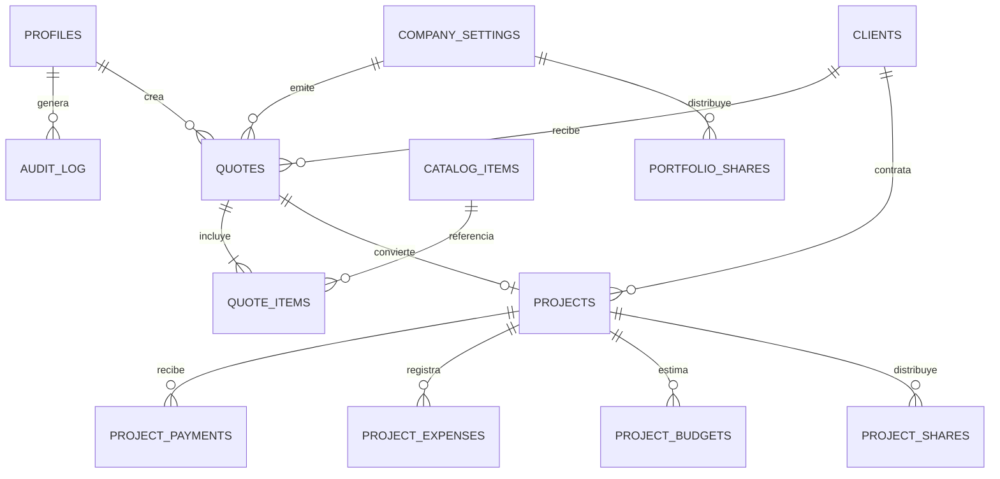

# Modelo de datos

## Criterios

El esquema vive en `public`, salvo las funciones de autorización en `private`. Las claves primarias son `uuid` con `gen_random_uuid()`. Todo monto o porcentaje usa `numeric(14,2)` y toda fecha de operación usa `date`. Cada tabla operativa tiene `created_at timestamptz not null default now()`, `updated_at timestamptz not null default now()`, `created_by uuid references public.profiles(id)` y `updated_by uuid references public.profiles(id)` cuando corresponda.

Los campos de texto que forman códigos o nombres no se normalizan visualmente; para unicidad sin considerar mayúsculas ni acentos se usan índices únicos sobre `lower(unaccent(valor))`.

## Relaciones

## Usuarios y configuración

### `profiles`

Extiende `auth.users`; la clave `id` referencia `auth.users(id)` con eliminación en cascada. Columnas: `full_name text not null`, `role app_role not null default 'management'`, `is_active boolean not null default true`, `created_at`, `updated_at`.

`app_role` es un enum con `administrator` y `management`. Un trigger de `auth.users` crea el perfil con rol `management`; la elevación a administrador ocurre por SQL inicial controlado o por una función autorizada. Las políticas consultan una función `private.is_active_member()` y `private.is_administrator()` para evitar recursión de RLS.

### `company_settings`

Una única fila con `id boolean primary key default true check (id)`, `legal_name text not null default 'Elecpro Ingeniería Eléctrica'`, `manager_name text not null`, `manager_role text not null`, `professional_card text`, `phone text`, `email text`, `address text`, `timezone text not null default 'America/Bogota'`, `currency_code text not null default 'COP'`, marcas de auditoría. Un `check` garantiza que `id` sea verdadero; insertar una segunda fila falla.

### `document_counters`

`key text primary key` y `last_value bigint not null default 0 check (last_value >= 0)`. La fila inicial tiene `key = 'quote'`. Una función bloquea la fila con `FOR UPDATE`, incrementa el número y devuelve `COT-<año>-<secuencia de cuatro dígitos>`. No calcular consecutivos desde filas existentes.

## Catálogos

### `clients`

`id`, `name text not null`, `client_type text not null`, `contact_name text`, `phone text`, `email text`, `address text`, `is_active boolean not null default true`, auditoría. Índice para nombre normalizado y para clientes activos.

### `suppliers`

`id`, `name text not null`, `phone text`, `email text`, `website text`, `description text`, `is_active boolean not null default true`, auditoría. Índice para nombre normalizado y búsqueda por activos.

### `catalog_items`

`id`, `code text not null`, `description text not null`, `unit text not null`, `base_unit_price numeric(14,2) not null check (base_unit_price >= 0)`, `category catalog_category not null`, `is_active boolean not null default true`, auditoría. `catalog_category` contiene `material` y `labor`. Índice único para código normalizado e índice de texto normalizado sobre código y descripción para búsqueda.

## Cotizaciones

### `quotes`

`id`, `number text not null`, `client_id uuid not null references clients(id)`, `status quote_status not null default 'draft'`, `issued_on date not null`, `valid_until date not null check (valid_until >= issued_on)`, `title text not null`, `greeting text not null default ''`, `project_description text not null default ''`, `objective text not null default ''`, `notes text not null default ''`, `scope text not null default ''`, `benefits text not null default ''`, `exclusions text not null default ''`, `payment_terms text not null default ''`, `execution_time text not null default ''`, `deliverable text not null default ''`.

También guarda los porcentajes: `material_increase_pct`, `administration_pct`, `contingency_pct`, `utility_pct`, `vat_utility_pct`, todos `numeric(7,2) not null default 0 check (valor >= 0)`. Incluye los totales instantáneos `direct_cost`, `administration_amount`, `contingency_amount`, `utility_amount`, `vat_utility_amount`, `total_amount` como `numeric(14,2) not null default 0`, `project_id uuid unique references projects(id)` (se añade después de crear proyectos) y auditoría.

`quote_status` tiene `draft`, `sent`, `approved`, `rejected`. El número es único. La función de guardado recalcula los totales a partir de los ítems y porcentajes recibidos; el cliente no determina importes definitivos.

### `quote_items`

`id`, `quote_id uuid not null references quotes(id) on delete cascade`, `position integer not null check (position > 0)`, `catalog_item_id uuid references catalog_items(id) on delete set null`, `code text not null default ''`, `description text not null`, `category catalog_category not null`, `quantity numeric(14,2) not null check (quantity >= 0)`, `unit text not null`, `base_unit_price numeric(14,2) not null check (base_unit_price >= 0)`, `final_unit_price numeric(14,2) not null check (final_unit_price >= 0)`, `base_total numeric(14,2) not null check (base_total >= 0)`, `final_total numeric(14,2) not null check (final_total >= 0)`, auditoría.

Índice único `(quote_id, position)`. `final_unit_price` y totales son instantáneas calculadas en la función de guardado: el vínculo al catálogo es solo trazabilidad.

## Proyectos y finanzas

### `projects`

`id`, `quote_id uuid unique references quotes(id)`, `quote_number text not null`, `client_id uuid not null references clients(id)`, `title text not null`, `project_value numeric(14,2) not null check (project_value >= 0)`, `status project_status not null default 'approved'`, `responsible text not null`, `location text not null`, `priority project_priority not null default 'medium'`, `start_date date not null`, `expected_end_date date not null check (expected_end_date >= start_date)`, `actual_end_date date check (actual_end_date is null or actual_end_date >= start_date)`, `observations text not null default ''`, `profit_mode profit_mode not null default 'value'`, `initial_profit numeric(14,2) not null default 0 check (initial_profit >= 0)`, auditoría.

Enums: `project_status` = `draft`, `quoted`, `approved`, `in_progress`, `paused`, `finished`, `cancelled`; `project_priority` = `low`, `medium`, `high`, `critical`; `profit_mode` = `value`, `manual`.

### `project_payments`

`id`, `project_id uuid not null references projects(id) on delete restrict`, `payment_date date not null`, `amount numeric(14,2) not null check (amount > 0)`, `payment_method text not null`, `note text not null default ''`, auditoría. Índice `(project_id, payment_date desc)`.

### `project_expenses`

Mismas columnas de movimiento: `id`, `project_id`, `expense_date`, `category text not null`, `amount numeric(14,2) check (amount > 0)`, `payment_method text not null`, `note text not null default ''`, auditoría. Índice `(project_id, expense_date desc)`.

### `project_budgets`

`id`, `project_id uuid not null references projects(id) on delete restrict`, `source budget_source not null default 'manual'`, `position integer`, `category text not null`, `note text not null default ''`, `quantity numeric(14,2)`, `base_unit_price numeric(14,2)`, `final_unit_price numeric(14,2)`, `base_total numeric(14,2)`, `final_total numeric(14,2)`, `amount numeric(14,2) not null check (amount >= 0)`, auditoría.

`budget_source` es `manual` o `quote_snapshot`. Para instantáneas de cotización, `amount` usa `base_total`, mientras los demás campos mantienen ambos importes. Para presupuesto manual basta `amount`; las columnas de instantánea quedan nulas. Índice `(project_id, position)`.

### `project_shares` y `portfolio_shares`

Ambas tablas contienen `id`, `participant text not null`, `mode share_mode not null`, `value numeric(14,2) not null check (value >= 0)`, `basis share_basis not null`, `is_paid boolean not null default false`, `paid_on date`, auditoría. `project_shares` tiene `project_id` obligatorio; `portfolio_shares` no. Un check exige `paid_on is null or is_paid`.

`share_mode`: `percent`, `fixed`. Bases de proyecto: `project_value`, `real_profit`; base de portafolio: `portfolio_profit`. Checks distintos en ambas tablas impiden combinaciones inválidas.

### `audit_log`

`id bigserial primary key`, `occurred_at timestamptz not null default now()`, `actor_id uuid references profiles(id) on delete set null`, `entity_type text not null`, `entity_id uuid`, `action audit_action not null`, `before_data jsonb`, `after_data jsonb`, `request_id uuid`. `audit_action`: `insert`, `update`, `deactivate`, `convert_quote`, `invite_user`, `change_role`, `disable_user`. Índices por `(entity_type, entity_id, occurred_at desc)` y `(actor_id, occurred_at desc)`. La tabla es solo de inserción para usuarios autenticados mediante funciones; no admite update/delete desde API.

## Vistas de lectura

La migración podrá crear `project_financial_summary` y `portfolio_financial_summary` para cálculos de lectura. Ambas deben usar `security_invoker = true`, no conceder más permisos que las tablas y calcular pagos, gastos, presupuesto, saldo y ganancia sin almacenar valores derivados redundantes.
